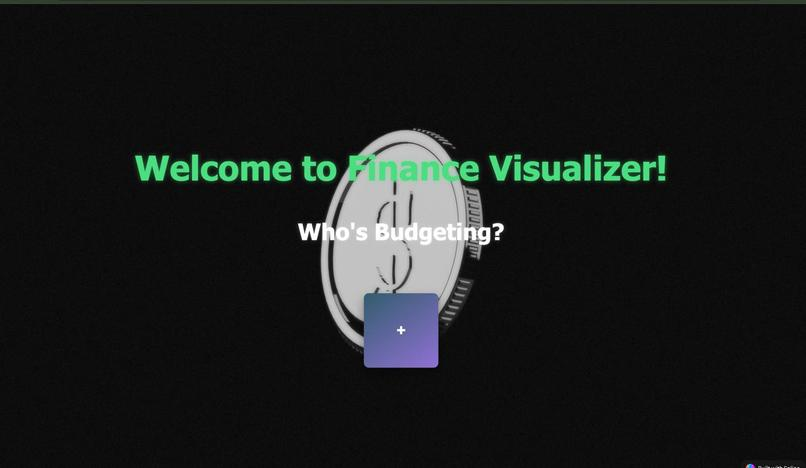

# 💸 **Finance Visualizer**

Welcome to **Finance Visualizer**, your interactive platform to track, manage, and visualize personal finances with style and precision.  
Empowering users to stay on top of their budget, loans, and spending trends with rich 3D and dynamic data visualizations.

---

## 🖼 **Preview**



---

## 📌 **Overview**

Finance Visualizer allows users to:
- Track their finances over time
- Get real-time insights into spending habits
- Visualize expenses, loans, and budgeting trends
- Engage with an immersive, 3D-enhanced interface

---

## ✨ **Key Features**

✅ **Personal Account Management**  
Each user can create and manage a profile to track budgets and dependencies securely.

✅ **Expense Breakdown**  
View categorized expenses using interactive pie charts (e.g., Rent, Food, Transport).

✅ **Monthly Spending Trends**  
Visualize monthly spending via bar charts for easy year-long comparisons.

✅ **Loan Tracking**  
Stay informed on loan balances and payments with dedicated loan management tools.

✅ **3D Interactive Background**  
Engage with a visually appealing, interactive background built with **Spline** and **Three.js**.

✅ **Responsive UI**  
Optimized for both desktop and mobile, ensuring smooth and seamless user experiences.

---

## 🛠 **Tech Stack**

### 🖥 **Frontend**
| Technology     | Purpose |
|----------------|---------|
| **React.js** | Dynamic UI components |
| **Next.js** | Server-side rendering, routing |
| **React Router** | Navigation |
| **Three.js** | 3D graphics and visualizations |
| **Spline** | Interactive 3D backgrounds |
| **CSS / Tailwind CSS** | Styling and responsiveness |

### 🗄 **Backend**
| Technology     | Purpose |
|----------------|---------|
| **Flask (Python)** | REST API for managing profiles, loans, transactions |

### 💾 **Database**
| Technology     | Purpose |
|----------------|---------|
| **MySQL** | Data storage: user profiles, transactions, loans |

---

## 🚀 **How to Run Locally**

1️⃣ **Clone the repository**
```bash
git clone [repository-url]
cd finance-visualizer
```

2️⃣ **Install frontend dependencies**
```bash
cd frontend
npm install
npm run dev
```

3️⃣ **Set up backend**
```bash
cd ../backend
python -m venv venv
source venv/bin/activate  # On Windows use `venv\Scripts\activate`
pip install -r requirements.txt
python app.py
```

4️⃣ **Configure your MySQL database**  
Set your connection string and run migrations or SQL setup scripts as needed.

---

## 🧠 **Future Enhancements**

🌟 **User Notifications:** Email or in-app alerts for budget limits or loan deadlines  
🌟 **Export Reports:** Downloadable PDF/CSV expense and loan summaries  
🌟 **Dark Mode:** Toggle between light/dark themes for accessibility  
🌟 **AI-Powered Recommendations:** Budgeting tips and loan optimizations  
🌟 **Multi-currency Support:** Manage finances in different currencies with exchange rates  

---

## 👥 **Team Members**

- **Ayush Bhardwaj** — Full Stack Developer  
- **Anupam Sai Sistla** — Full Stack Developer  
- **Nathan Trinh** — Front End Developer  

